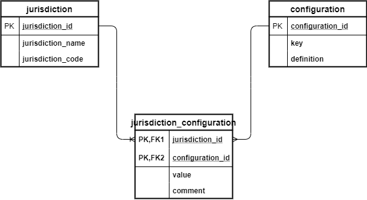

# nolimit / Demo
- This is a test application for jurisdiction services which can be used in gaming an gambling companies to view list of rules or configurations per market.
- It can provide a machine readable view of the requirements (by creating API), which can then be read by different services/systems to configure depending upon which jurisdictions they are operating in.

* **Features :**
  - View our list of jurisdictions.
  - Add new jurisdiction code for new market.
  - View our configuration per jurisdiction with dynamic search option.
  - Add new jurisdiction configuration.
  - All data are persistance in our database.

* **More feature to add in future:**
  - Add new confiqurations (it will just be repeating for some pages)
  - Create REST API to expose the data.
  - unit and integration code not added yet.
* **Used Technologies :**
  - Java JDK 11.0.7
  - mysql 8.0.19 
  - Jetty 9.4.28 for application server
  - Spring MVC
  - Spring data JPA
  - Flyway 6.0.8 for mysql database integration
  
* **Data base ERD diagram :**

# Prerequisite
* **Mysql Database setup :**

  - Final Product requires External MySql Database, So mysql server should be running.
  we can install from here : https://dev.mysql.com/downloads/installer/
  In mysql run the folowing commands:
   - CREATE DATABASE nolimit_test;
   - CREATE USER 'demo'@'localhost' IDENTIFIED BY 'demo';
   - GRANT ALL PRIVILEGES ON nolimit_test.* TO 'demo'@'localhost';
   
**Note** : we can use docker to run mysql container.

* **How to install and run :**

  1 - Clone the project repository to your local machine.
  2 - From IDE , terminal or cmd go to the path directory.
  3 - Run this command : mvn clean install
  4 - After building successfully go to target and run : java -jar demo-0.0.1-SNAPSHOT.jar
  5 - Open home page in browser : http://localhost:9090/home

**Note** : if you have jar file go to step 4 directly.

